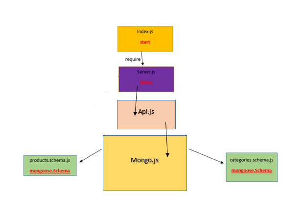

# LAB - Class 09

## Project: API-server

### Author: Batool Al-Ali

### Links and Resources

- [submission PR](https://github.com/batool-alali-401-advanced-javascript/api-server/pull/13)
- [Heroku App](https://api-server-2020.herokuapp.com/)
- [API Swagger Doc](https://app.swaggerhub.com/apis/batoolalali/default-title/0.2)
- [JsDoc](https://api-server-2020.herokuapp.com/)
- [ci/cd](https://github.com/batool-alali-401-advanced-javascript/api-server/runs/743680889) (GitHub Actions)
- [back-end server url](http://xyz.com) (when applicable)

### Setup
- .env => 
    - PORT
    - MONGODB_URI

#### How to initialize/run your application 
- `$ npm init -y`
- `$nodemon`

#### Libraries:
- 'dotenv'
- 'express'
- 'supertest' for testing the server.
- 'morgan'
- 'mongoose'

#### tests:
- `$ npm test`
- `$npm run lint`

#### UML
