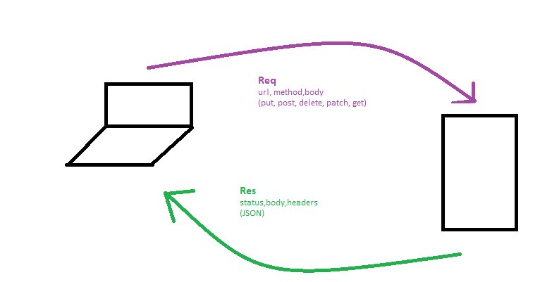

# LAB - Class 06

## Project: API-server

### Author: Batool Al-Ali

### Links and Resources

- [submission PR](https://github.com/batool-alali-401-advanced-javascript/api-server/pull/1)
- [API Doc](https://app.swaggerhub.com/apis/batoolalali/API-server/0.1)
- [ci/cd](http://xyz.com) (GitHub Actions)
- [back-end server url](http://xyz.com) (when applicable)
- [front-end application](http://xyz.com) (when applicable)

### Setup
nothing

#### How to initialize/run your application 

- `$ json-server --id=_id --routes ./data/routes.json  --watch ./data/db.json`

#### UML
